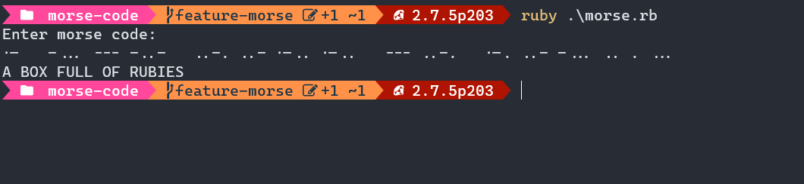

# Morse code decoder
> A gem to decode Morse code

## Built With

- Ruby

## Getting Started

To get a local copy follow these simple example steps.  

1.- Open the terminal window and clone the repository using this command:  
`git@github.com:VicPeralta/morse-code.git` 

2.- Change the directory to the chess-leaders directory  
`cd morse-code`  
3.- Install the project's dependencies by running this command:   
`bundle install`  
4.- Generate the dist folder using this command:  
`ruby ./morse.rb`  

## Authors

👤 **Juan Luis Palacios**

- GitHub: [@JuanLPalacios](https://github.com/JuanLPalacios)
- Twitter: [@JuanLuisPalac20](https://twitter.com/twitterhandle)
- LinkedIn: [LinkedIn](https://www.linkedin.com/in/juan-luis-palacios-p%C3%A9rez-95b39a228/)

👤 **Victor Peralta**
- GitHub: [@VicPeralta](https://github.com/VicPeralta)
- Twitter: [@VicPeralta](https://twitter.com/VicPeralta)
- Linkedin: [@VicPeralta](https://www.linkedin.com/in/vicperalta/)

## 🤝 Contributing

Contributions, issues, and feature requests are welcome!

Feel free to check the [issues page](../../issues/).

## Show your support

Give a ⭐️ if you like this project!

## 📝 License

This project is [MIT](./LICENSE.md) licensed.

